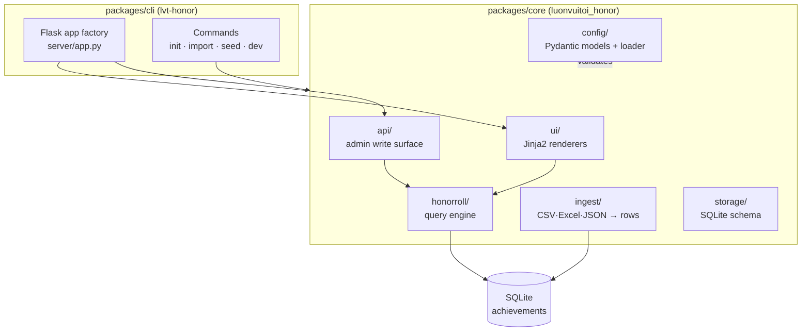

# Architecture

LUONVUITUOI-HONOR ROLL is a config-driven monorepo, deliberately mirroring the structure of its sibling [LUONVUITUOI-CERT](https://github.com/Kein95/luonvuituoi-cert). The two share conventions so a contributor comfortable with one is comfortable with the other.

## Layered design

The core package remains **web-framework-agnostic**. Each handler is a pure function that accepts a `db_path` plus filters and returns dataclasses or rendered HTML. The Flask app factory in `cli/.../server/app.py` constitutes a thin layer that calls these handlers and serializes results, without any business logic in routes. Consequently, a future serverless handler (Vercel, Cloud Run) can reuse every pure function unchanged.

## Data model: one flat table

Unlike CERT (which maintains a table per round), the honor roll uses a **single flat `achievements` table** with one row per award. This represents the natural unit: a student with three medals produces three rows, and every public listing executes a single indexed `SELECT` with filters rather than fanning out across per-edition tables.

| column | purpose |
|--------|---------|
| `id` | autoincrement PK |
| `competition_id`, `year` | the edition (filter + label) |
| `candidate_no`, `name`, `school` | identity |
| `subject_code`, `medal`, `rank`, `percentile` | the award |
| `created_at` | ingest timestamp |

Indexes on `(competition_id, year, medal, subject_code)`, `name`, and `candidate_no` keep the filter + search queries fast.

## Config validation

`honor.config.json` undergoes validation by Pydantic models with `extra="forbid"`. Cross-field invariants (editions reference declared competitions, every competition's medals exist in the global registry, IDs/codes/ranks are unique) reside in `@model_validator` hooks on `HonorConfig`, ensuring that a malformed config fails at load time rather than producing a half-rendered portal.

## Domain difference from CERT

| Aspect | CERT | HONOR ROLL |
|--------|------|------------|
| **Unit** | one student per round | one award (student × subject × medal) |
| **Store** | per-round tables | single flat `achievements` table |
| **Public output** | search → download PDF | filter → browse gallery |
| **Write surface** | admin issues/corrects certificates | admin adds/deletes achievements |
| **Signing** | RSA-PSS QR verify | none (publishing, not attestation) |

The shared conventions: config-driven, monorepo (`packages/core` + `packages/cli` + `examples`), pure-function core, thin Flask factory, CSP-nonce + security headers, i18n (EN + VI), and identical dev/deploy ergonomics (`lvt-*` CLI, Vercel + Docker).
