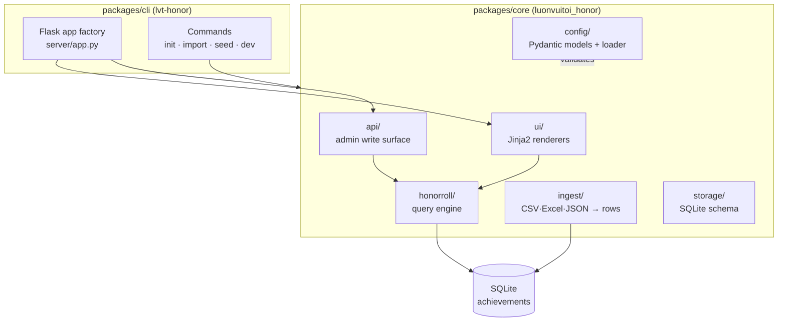

# Kiến trúc

LUONVUITUOI-HONOR ROLL là một monorepo được điều khiển bằng cấu hình, được thiết kế để phản chiếu cấu trúc của dự án anh em [LUONVUITUOI-CERT](https://github.com/Kein95/luonvuituoi-cert). Hai dự án chia sẻ các quy ước, vì vậy người đóng góp quen thuộc với một dự án cũng sẽ quen thuộc với dự án kia.

## Thiết kế phân tầng

Gói lõi vẫn **độc lập với web framework**. Mỗi handler là một hàm thuần túy: nhận `db_path` cùng bộ lọc, trả về dataclass hoặc HTML đã kết xuất. App factory của Flask trong `cli/.../server/app.py` chỉ là một lớp mỏng, gọi các handler này rồi tuần tự hóa kết quả, không chứa bất kỳ logic nghiệp vụ nào trong route. Nhờ vậy, một handler serverless trong tương lai (Vercel, Cloud Run) có thể tái sử dụng mọi hàm thuần túy mà không cần thay đổi.

## Mô hình dữ liệu: một bảng phẳng

Khác với CERT (lưu mỗi vòng thi một bảng), bảng vinh danh dùng một **bảng `achievements` phẳng duy nhất**, mỗi giải thưởng là một hàng. Đây là đơn vị tự nhiên: một học sinh có ba huy chương sẽ tạo ra ba hàng, và mọi danh sách công khai đều chạy một câu `SELECT` được lập chỉ mục kèm bộ lọc, thay vì phải truy vấn tản ra nhiều bảng theo từng phiên bản.

| cột | mục đích |
|-----|---------|
| `id` | autoincrement PK |
| `competition_id`, `year` | phiên bản (bộ lọc + nhãn) |
| `candidate_no`, `name`, `school` | danh tính |
| `subject_code`, `medal`, `rank`, `percentile` | giải thưởng |
| `created_at` | dấu thời gian nhập liệu |

Chỉ mục trên `(competition_id, year, medal, subject_code)`, `name` và `candidate_no` giữ cho các truy vấn bộ lọc và tìm kiếm nhanh chóng.

## Xác thực cấu hình

`honor.config.json` được xác thực bằng các mô hình Pydantic với `extra="forbid"`. Các bất biến liên trường (phiên bản phải tham chiếu cuộc thi đã khai báo, huy chương của mỗi cuộc thi phải tồn tại trong sổ đăng ký toàn cục, các ID/mã/thứ hạng phải là duy nhất) nằm trong các hàm `@model_validator` trên `HonorConfig`. Cấu hình sai định dạng sẽ báo lỗi ngay khi tải, nhờ đó không bao giờ tạo ra một cổng thông tin chỉ kết xuất được một nửa.

## Sự khác biệt về miền so với CERT

| Khía cạnh | CERT | HONOR ROLL |
|----------|------|-----------|
| **Đơn vị** | một học sinh cho mỗi vòng | một giải thưởng (học sinh × môn học × huy chương) |
| **Lưu trữ** | bảng theo vòng | bảng `achievements` phẳng duy nhất |
| **Đầu ra công khai** | tìm kiếm → tải xuống PDF | bộ lọc → duyệt thư viện |
| **Bề mặt ghi** | quản trị viên cấp/sửa chữa chứng chỉ | quản trị viên thêm/xóa thành tích |
| **Ký số** | xác minh QR bằng RSA-PSS | không có (chỉ xuất bản, không chứng thực) |

Các quy ước dùng chung: điều khiển bằng cấu hình, monorepo (`packages/core` + `packages/cli` + `examples`), lõi gồm các hàm thuần túy, app factory Flask mỏng, CSP-nonce kèm các header bảo mật, đa ngôn ngữ (EN + VI) và trải nghiệm phát triển/triển khai giống hệt nhau (`lvt-*` CLI, Vercel + Docker).
