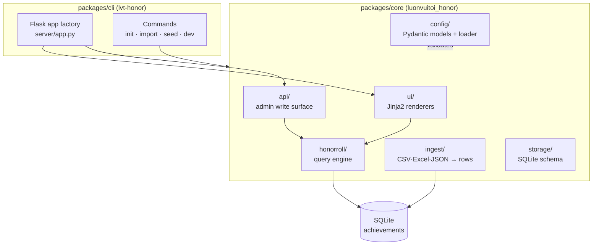

# Kiến trúc

LUONVUITUOI-HONOR ROLL là một monorepo được điều khiển bằng cấu hình, được thiết kế để phản chiếu cấu trúc của dự án anh em [LUONVUITUOI-CERT](https://github.com/Kein95/luonvuituoi-cert). Hai dự án chia sẻ các quy ước, vì vậy người đóng góp quen thuộc với một dự án cũng sẽ quen thuộc với dự án kia.

## Thiết kế phân tầng

Gói lõi vẫn **độc lập với web framework**. Mỗi handler là một hàm tinh khiết: lấy `db_path` + bộ lọc, trả về dataclasses / HTML được kết xuất. Nhà máy ứng dụng Flask trong `cli/.../server/app.py` là một lớp mỏng gọi các handler này và tuần tự hóa kết quả — không có logic kinh doanh trong các route. Điều này có nghĩa là một handler serverless trong tương lai (Vercel, Cloud Run) sẽ tái sử dụng mọi hàm tinh khiết không thay đổi.

## Mô hình dữ liệu: một bảng phẳng

Khác với CERT (lưu trữ một bảng cho mỗi vòng), bảng vinh danh sử dụng một **bảng `achievements` phẳng duy nhất** — một hàng cho mỗi giải thưởng. Đây là đơn vị tự nhiên: một học sinh với ba huy chương tạo ra ba hàng, và mọi danh sách công khai là một `SELECT` được lập chỉ mục duy nhất với bộ lọc, không phải là fan-out trên các bảng theo từng phiên bản.

| cột | mục đích |
|-----|---------|
| `id` | autoincrement PK |
| `competition_id`, `year` | phiên bản (bộ lọc + nhãn) |
| `candidate_no`, `name`, `school` | danh tính |
| `subject_code`, `medal`, `rank`, `percentile` | giải thưởng |
| `created_at` | dấu thời gian nhập liệu |

Chỉ mục trên `(competition_id, year, medal, subject_code)`, `name` và `candidate_no` giữ cho các truy vấn bộ lọc và tìm kiếm nhanh chóng.

## Xác thực cấu hình

`honor.config.json` được xác thực bởi các mô hình Pydantic với `extra="forbid"`. Các bất biến giữa các trường (các phiên bản tham chiếu các cuộc thi được khai báo, mỗi cuộc thi có các huy chương tồn tại trong sổ đăng ký toàn cầu, ID/mã/xếp hạng là duy nhất) nằm trong các móc `@model_validator` trên `HonorConfig`, vì vậy một cấu hình sai định dạng sẽ không thành công to lớn khi tải — không bao giờ tạo ra một cổng thông tin được kết xuất một nửa.

## Sự khác biệt về miền so với CERT

| Khía cạnh | CERT | HONOR ROLL |
|----------|------|-----------|
| **Đơn vị** | một học sinh cho mỗi vòng | một giải thưởng (học sinh × môn học × huy chương) |
| **Lưu trữ** | bảng theo vòng | bảng `achievements` phẳng duy nhất |
| **Đầu ra công khai** | tìm kiếm → tải xuống PDF | bộ lọc → duyệt thư viện |
| **Bề mặt ghi** | quản trị viên cấp/sửa chữa chứng chỉ | quản trị viên thêm/xóa thành tích |
| **Ký** | xác minh QR RSA-PSS | không (xuất bản, không xác thực) |

Các quy ước được chia sẻ: được điều khiển bằng cấu hình, monorepo (`packages/core` + `packages/cli` + `examples`), lõi hàm tinh khiết, nhà máy Flask mỏng, CSP-nonce + tiêu đề bảo mật, i18n (EN + VI) và kinh tế ergonomics dev/deploy giống hệt (`lvt-*` CLI, Vercel + Docker).
